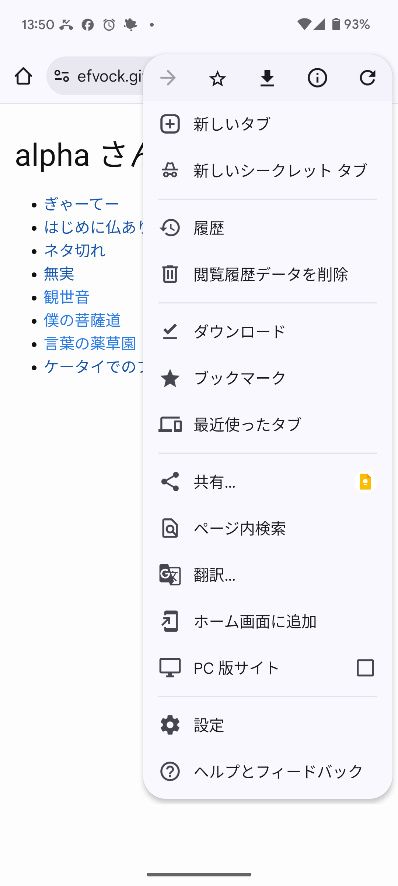
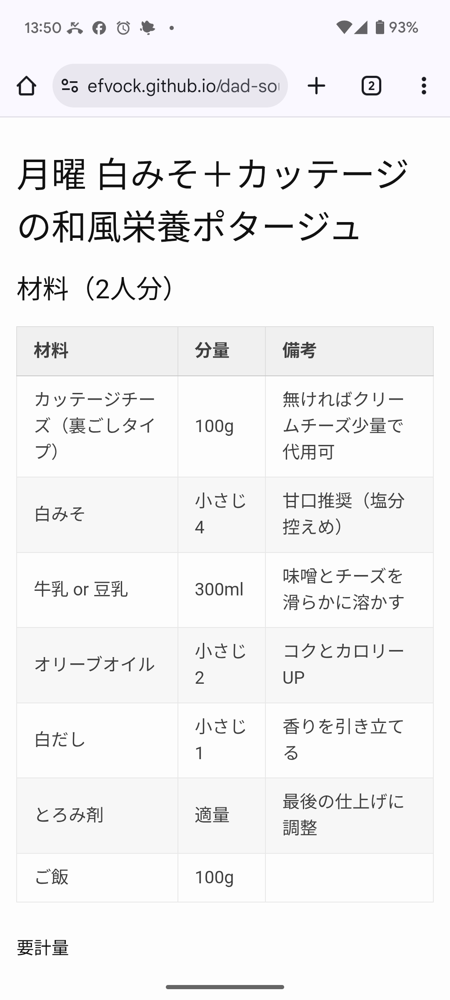
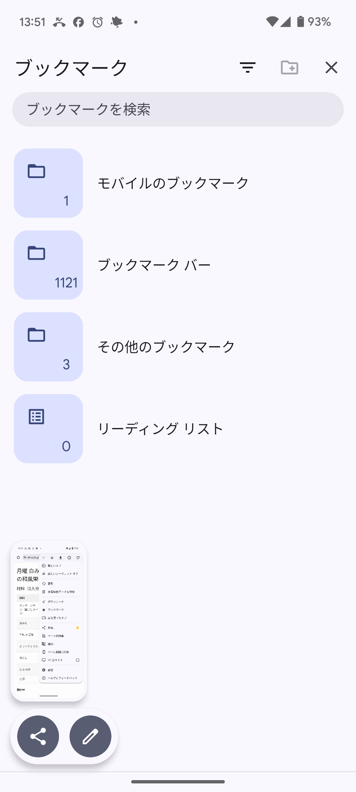

ブックマークについての操作は二つあります。

A. ブックマークする、つまりインターネットという本にしおりをはさむ  
B. 前にブックマークしたページを開く。

## A. ブックマークする

ブックマークしたいページが開いている状態で ︙ をタップ。

次ような画面になるので、画面上の方の ☆ をタップ。

これで、そのページをブックマークしたことになります。

## B. 前にブックマークしたページを開く

Chrome とは、こんな絵のアプリです。
ブラウザーの一種です。
ブラウザーとは、インターネットという本を読むためのアプリです。

Chrome が開いた状態で ︙ をタップ。

次のような画面になるので「★ ブックマーク」をタップ。

続いて次のような画面になるので「モバイルのブックマーク」をタップ。

続いて次のような画面になるので、目的のブックマーク(ここでは Yahoo! JAPAN) をタップ。

