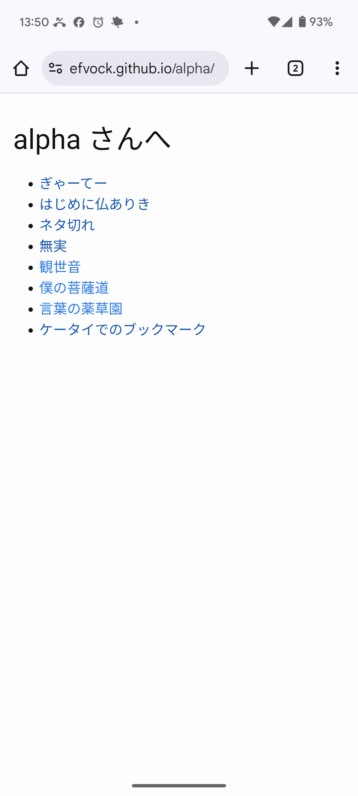
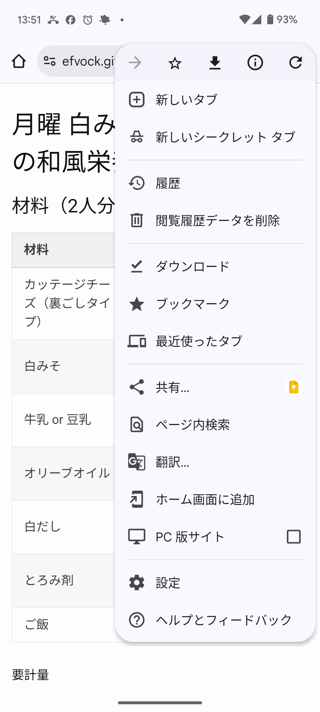

## A. ブックマークする

ブックマークしたいページが開いている状態で ︙ をタップ。

次ような画面になるので ☆ をタップ。

これで、そのページをブックマークしたことになる。

## B. ブックマークしたページに飛ぶ

Chrome (ブラウザー)が開いた状態で ︙ をタップ。

次のような画面になるので「⭑ ブックマーク」をタップ。

続いて次のような画面になるので「モバイルのブックマーク」をタップ。

続いて次のような画面になるので、目的のブックマーク(ここでは Yahoo! JAPAN) をタップ。

